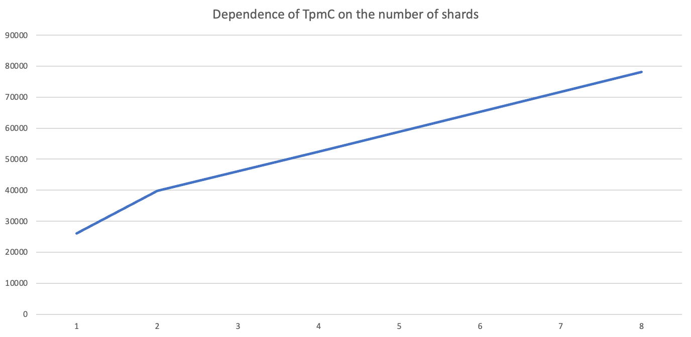

# SPQR benchmarks

TPC-C (Transaction Processing Performance Council - C) benchmark is a standardized performance test used to measure the performance of database systems under conditions of high load and a large number of transactions. It simulates the operation of an online store with a large number of simultaneous users, each of whom performs various operations with goods, such as viewing, adding to the cart, buying, etc.

There are a lot of implementations of TPC-C test, in our experiments we use [Percona TPC-C Variant](https://github.com/Percona-Lab/sysbench-tpcc).

We ran PostgreSQL on s3.medium (8 vCPU, 100% vCPU rate, 32 GB RAM) instances and 300 GB of memory with default Managed PostgreSQL Cluster settings. In each test we increasing shard count only.

### Results

| Warehouses | Shards    | CPU | TPS  | TpmC  | TpmC per CPU |
| ---------- | --------- | --- | ---- | ----- | ------------ |
| 1000       | no router | 8   | 433  | 26010 | 3251.25      |
| 1000       | 2	       | 16  | 664  | 39840 | 2490         |
| 1000       | 4	       | 32  | 875  | 52500 | 1640.625     |
| 1000       | 8	       | 64  | 1303 | 78180 | 1221.5625    |
| 1000       | 16        | 128 | 1543 | 92580 | 723.28125    |

As you can see, one router scales workload decently up to 8 shards.

However, at some point adding more routers is necessary. But still there's a big room for improvement of router performance.

You can compare this results with [Vitess and Aurora](https://www.amazon.science/publications/amazon-aurora-on-avoiding-distributed-consensus-for-i-os-commits-and-membership-changes), Perfomance Results.